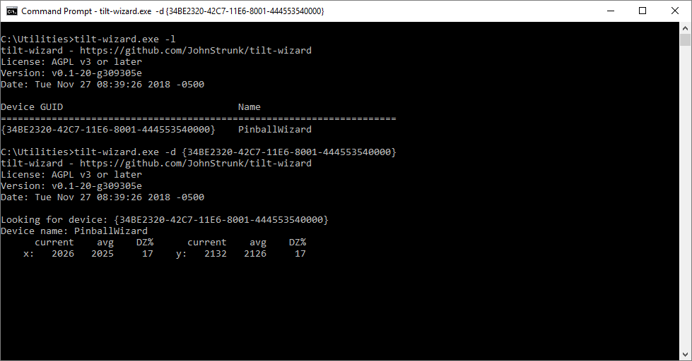

# tilt-wizard

[](https://dev.azure.com/johnstrunk/tilt-wizard/_build/latest?definitionId=1)

`tilt-wizard` is a simple Windows cli program to automatically calibrate
DirectInput-based motion sensors used for Virtual Pinball.

## Background

When building a virtual pinball cabinet, a popular option to add is a motion
sensor so that it is possible to "nudge" the table while playing and have this
real-life jostling of the table affect the movement of the virtual pinball.

When I built my table, I chose to use the [Mot-Ion
controller](http://www.nanotechgaming.com/mot-ionkit.php). It appears to the
computer as a gamepad with the x and y axes detecting motion of the cabinet.
Unfortunately, these units have a good bit of noise to them, are difficult to
calibrate, and their center point tends to change with temperature.

This project is my attempt to create a simple executable that automatically
calibrates the center, limits, and deadzone on-the-fly.

## Using tilt-wizard

Download the latest version from the [Releases
page](https://github.com/JohnStrunk/tilt-wizard/releases).

Run `tilt-wizard` with no arguments to scan for available DirectInput devices:

```
C:\tilt-wizard>tilt-wizard.exe
```

This should discover any devices attached to your computer. To have tilt-wizard
automatically tune the device, pass in the GUID of the desired device:

```
C:\tilt-wizard>tilt-wizard.exe {34BE2320-42C7-11E6-8001-444553540000}
```

The application will then run, sampling the X & Y axes and updating the center
point.

- `current`: The most recent sample
- `avg`: The currently calculated average (and center point)
- `stdev`: The calculated standard deviation of the incoming data. You probably
  want to manually set the deadzone percentage to approximately 4x this value.

Example:



To integrate tilt-wizard with your pinball cabinet, see the [installation
document](docs/installation.md).

## Building from source

You will need [MinGW-w64](http://www.mingw-w64.org/) to build the source. While
you can download and install it directly, I recommend using
[Chocolatey](https://chocolatey.org/). Chocolatey is [easy to
install](https://chocolatey.org/install#install-with-cmdexe) and once you get it
running, you can install MinGW-w64 via:

```
C:\>choco install mingw
...
```

Once you have the prerequisites installed, make sure you update your PATH. In my case, that was:

```
set PATH=%PATH%;C:\ProgramData\chocolatey\lib\mingw\tools\install\mingw64\bin
```

You should now be able to build via:

```
C:\tilt-wizard>mingw32-make
... build output ...
```

Then run it via:

```
C:\tilt-wizard>tilt-wizard.exe
```
