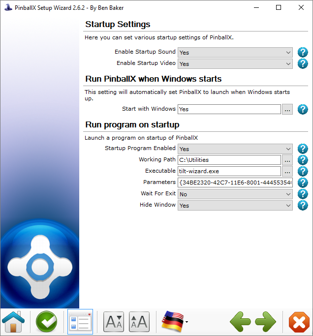
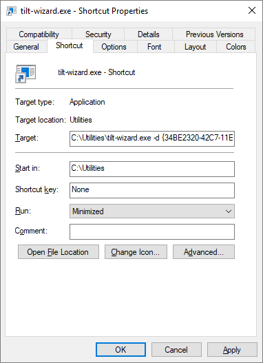

# Installation

This document provides installation guidance for integrating tilt-wizard with
your pinball setup.

Installation options:

- [Integration with PinballX](#pinballx)
- [Run during Windows startup](#run-on-startup)

---

## PinballX

Integrating with [PinballX](https://www.pinballx.com/) is fairly
straightforward. Make a note of:

- the directory where you have placed the `tilt-wizard.exe` Program
- the GUID of the device you want to automatically calibrate

Launch the PinballX configuration program and go the "Startup settings" menu.
Configure tilt-wizard to run on startup as shown below. Substitute the directory
of `tilt-wizard.exe` for the "Working path" and in the "Parameters" field, put
"`-d`" and your device GUID.

## Run on startup

Tilt-wizard can also be configured to run at startup by creating a shortcut and
placing that in your Startup folder.

- Locate the `tilt-wizard.exe` executable, right-click, and select "Create
  shortcut".
- Right-click the shortcut and select "Properties".
- In the "Shortcut" tab:
  - Add `-d` and your device GUID to the end of the "Target" field.
  - Change the "Run" field to "Minimized".
  - Click "OK".

After following the above, double clicking the shortcut should start a minimized
window w/ tilt-wizard tuning your device.

Move **just the shortcut** to your startup folder. The folder will be at a path
similar to: `C:\Users\johns\AppData\Roaming\Microsoft\Windows\Start
Menu\Programs\Startup`. Remember to replace my username (johns) with your own.
